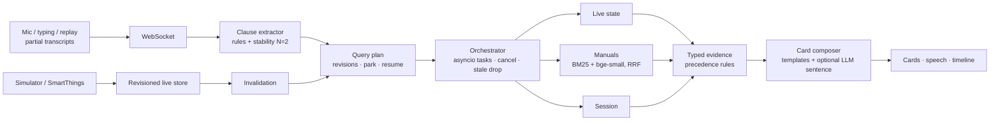

# PROCASTO-AI

**A smart-home assistant that starts looking things up while you're still talking.**

Ask "how long until the washer finishes…" and before you finish the sentence it has already read the washer's live state. If the washer faults mid-sentence, the answer rewrites itself. Say "wait, I meant the dryer" and the washer question is parked, not thrown away; "go back to the washer" brings it back, re-using what's still fresh and re-fetching only what changed. Every answer cites where it came from and how fresh it is.

Streaming, interruptible, multi-source RAG over three sources: live device state, device manuals (hybrid BM25 + dense search), and the conversation itself.

## Run it

Needs Python 3.12+, [uv](https://docs.astral.sh/uv/), Node 20+.

```bash
make setup
```

```bash
make dev
```

Open http://localhost:5180 and press **Replay demo** (or `R`). No API keys needed: the home is simulated and answers are written from templates plus the manuals. The first start downloads a 67 MB embedding model (set `DENSE_SEARCH=false` in `.env` to skip it; search then uses BM25 only).

Windows without `make` (PowerShell or Git Bash, from the repo root):

```bash
cd backend && uv sync --extra dense && cd ../frontend && npm install
```

```bash
backend/.venv/Scripts/python -m uvicorn app.main:create_app --factory --app-dir backend --port 8000
```

```bash
npm --prefix frontend run dev
```

Single process (what you'd deploy): `npm --prefix frontend run build`, then run only the uvicorn command above and open http://localhost:8000.

## The 20-second demo

Press **Replay demo**. It drives the exact same code path as a live microphone (partial transcripts over the WebSocket), with captions:

1. The home is live. The washer is running with 14 minutes left. "Under the hood" opens.
2. "How long until the washer finishes and what temperature is it washing at": the clause *washer · status* turns stable after two partial transcripts and the live-state lookup fires. The **head start** badge ends up around 2 s: that's how long before the end of the sentence the first grounded retrieval started.
3. Mid-sentence the washer throws **E3**. The status card flips to *Stopped · Error E3* on its own, the engine auto-adds an E3 lookup, and cards for the problem and the fix appear, citing **WW90T manual §E3 p.41**.
4. The voice starts explaining. "Wait I meant the dryer" cuts it off instantly; the washer plan is **parked** (blue), the dryer answer appears.
5. "OK go back to the washer": the parked answer returns. The badge shows **1 reused · 1 refetched**: the manual answer was still valid, the washer's live reading had changed while parked.

Try it by hand too: talk (hold **Space**, Chrome or Edge) or type (every word streams on the space bar), tap a suggestion chip, or break something from the bar at the bottom (`1`–`5`). Ask "why is the AC using so much power" after an AC spike and confirm the suggested fix; the simulated AC actually changes.

## How it works



- **Stability rule.** Browser speech recognition rewrites earlier words, so a clause only counts once it appears in two consecutive partials. Clauses with no device ("how long is left") wait for the end of the sentence, so "go back to…" can't resume the wrong plan.
- **Revisions everywhere.** Every plan change bumps a revision; every device event bumps that device's revision. A result that arrives after its plan moved on is dropped, and the drop is shown.
- **Park and resume.** A correction to another device parks the whole plan with its evidence (up to 3). Resume re-uses evidence whose device revision is still current and re-fetches the rest.
- **Precedence is code, not the LLM.** Live readings beat the conversation, which beats manual defaults. Manuals must match the device's model (or family). The LLM, if enabled, only writes one or two sentences from already-resolved facts, with a 1.5 s timeout that falls back to the manual's own words.
- **Material changes only.** Power noise and a tenth of a degree don't churn answers; a state change, an error code, a new target or a >25 % power jump does.

## Status, honestly

| Area | Status |
|---|---|
| Streaming clauses, plans, orchestrator, stale drops, invalidation, park/resume, precedence, cards, metrics, replay (F1–F17, F20–F22) | ✅ built and tested (backend 197 tests, 95 % coverage; frontend 26 tests) and run end to end in the browser |
| Voice in (Web Speech interim results) and out (speechSynthesis, instant stop) (F5, F19) | ✅ built; automated tests cover the stop path and echo guard. Live mic needs Chrome/Edge and internet (Google's speech service) and was not tested with a real microphone here. Use headphones on stage: speakers can leak the voice back into the mic (an echo guard filters most of it) |
| Confirmed device commands (F24) | ✅ on the simulator. Real devices need `ALLOW_COMMANDS=true` |
| SmartThings (F23) | ⚠️ built against the official SDK's signature scheme and payloads, tested with signed fixtures and mocked APIs; **not run against a real SmartThings account**. Needs an API Access app, a public tunnel URL, and a check of the OAuth endpoints in the Developer Workspace |
| Gemini phrasing (F18, M11) | ⚠️ implemented and tested against a mocked API; not run with a real key. Off by default |
| Alexa (F25) | ⚠️ endpoint tested with fixture requests; not run in the Alexa simulator. No Alexa certificate-chain verification yet (required before publishing a skill). Alexa only sends final utterances: no streaming or barge-in on that path |
| Local Jamba model, deploy, recorded video (M11 option, M13) | ❌ not done |

## Configuration

Copy `.env.example` to `.env`. Everything has a working default.

| Variable | Default | What it does |
|---|---|---|
| `DEVICE_PROVIDER` | `sim` | `smartthings` for real devices |
| `LLM_PROVIDER` | `fake` | `gemini` to phrase the "what to do" sentence with Gemini (`GEMINI_API_KEY`, `GEMINI_MODEL`) |
| `DENSE_SEARCH` | `true` | `false` = BM25 only, no model download |
| `ALLOW_COMMANDS` | `false` | allow confirmed commands on real devices |
| `CLAUSE_STABILITY_N` | `2` | partials a clause must survive |
| `TASK_TIMEOUT_MS` / `LLM_TIMEOUT_MS` | `3000` / `1500` | retrieval and phrasing timeouts |
| `SMARTTHINGS_CLIENT_ID` / `_SECRET` / `_REDIRECT_URI`, `PUBLIC_BASE_URL` | empty | SmartThings OAuth and webhook |
| `ALEXA_SKILL_ID` | empty | only answer requests for this skill |

## Tests and checks

```bash
make test
```

```bash
make lint
```

```bash
make deadcode
```

`make types` regenerates `frontend/src/types/generated.ts` from the Pydantic models; a test fails if they drift. `WORKING_STATE.md` records every verified state and `LESSONS.md` every bug and its fix.

## What we claim, and what we don't

We claim: retrieval starts from stable clauses before the utterance ends, and the head start is measured, not assumed; device events and speech feed one revisioned plan; corrections cancel or park only what they affect and resume re-uses fresh evidence; every card cites its source and freshness; the simulator and SmartThings share one provider contract.

We don't claim: sub-200 ms full answers, exact LLM resumption, zero hallucination (templates carry every fact precisely so the LLM can't invent one), or streaming through Alexa.
