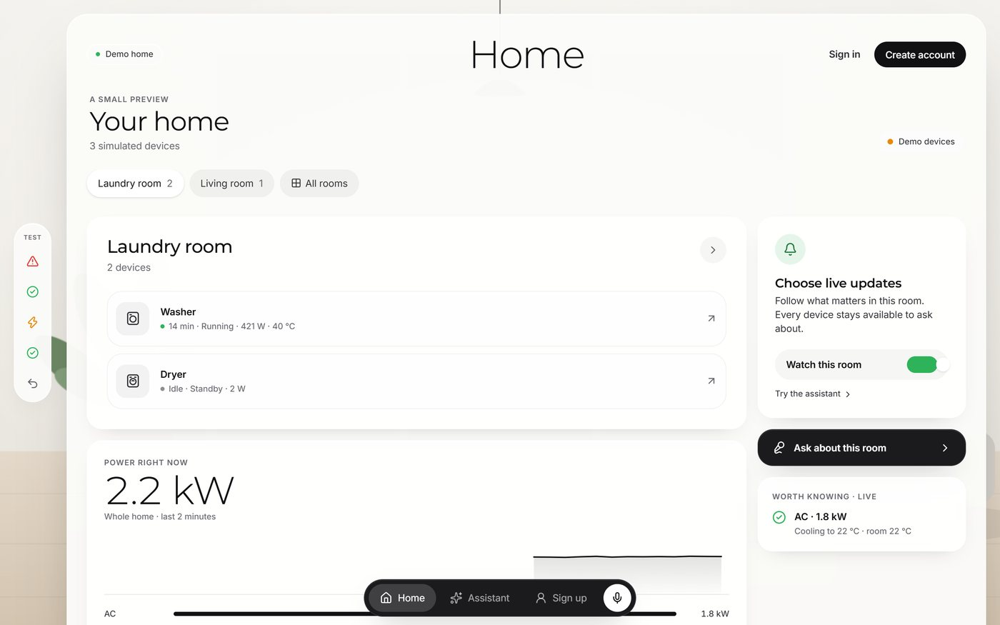
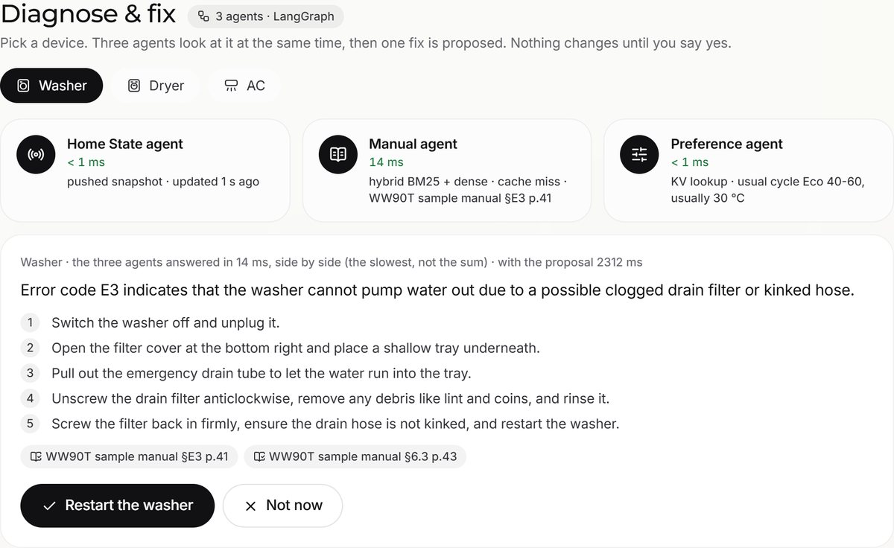
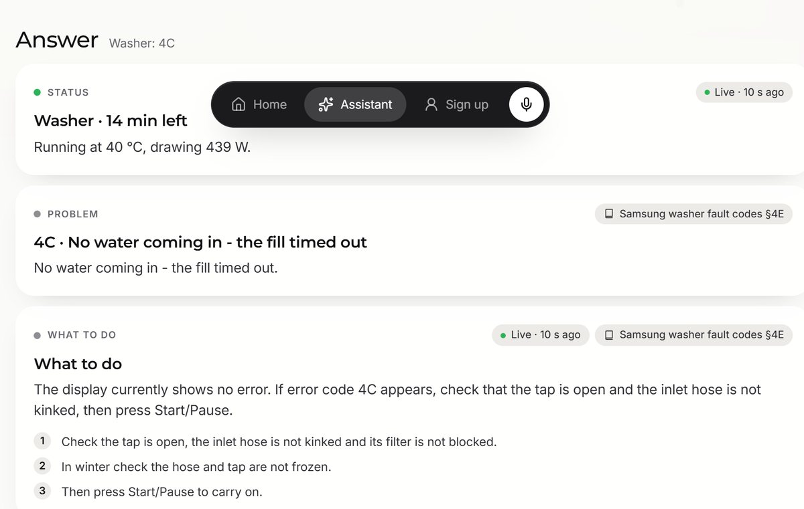
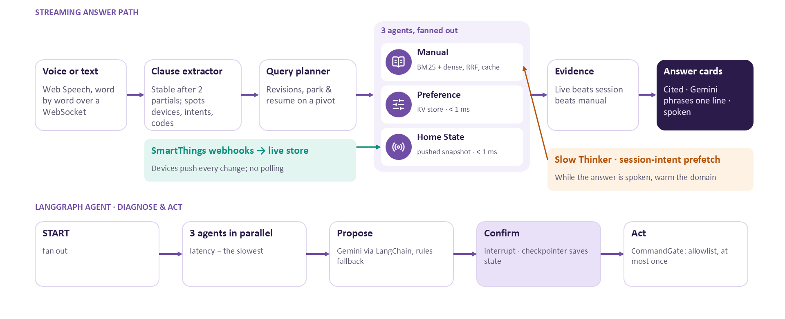

# PROCASTO · Your home, explained

**A voice assistant for the Samsung SmartThings home that answers from live device state and that model's manual,
starts looking things up before you finish speaking, and keeps up when you change your mind.**

Samsung PRISM Generative AI Hackathon, 3rd edition (2026–27) · Theme 4: Streaming live RAG · Team PROCASTO, Thapar Institute of
Engineering and Technology

| | |
|---|---|
| **Live demo** | [procasto.vercel.app](https://procasto.vercel.app) (open **Try the live demo**, no account needed) |
| **Film (92 s)** | [watch](https://procasto.vercel.app/media/procasto-film.mp4) · source in [`video/`](video) |
| **Presentation** | [`docs/PROCASTO_Presentation.pptx`](docs/PROCASTO_Presentation.pptx) |
| **Architecture** | [diagram below](#how-it-works) |



> The website is hosted on Vercel; the live engine (WebSockets, simulator, agents) runs on the team's machine and is
> reached through a tunnel during judging. If the demo shows "Connecting…", the engine is offline: run it locally in
> two commands ([below](#run-it-locally)).

---

## Try it in 60 seconds

1. Open [procasto.vercel.app/demo](https://procasto.vercel.app/demo). You get your own simulated home: a washer, a dryer
   and an AC, live.
2. Press **1**: the washer breaks with **E3** (keys **1** to **5** each break something). A followed device raises an alert with
   an **Ask** button.
3. Open **Assistant** and ask, by voice (Chrome or Edge, hold **Space**) or typing: *"What does 4C mean on the washer?"*
   The answer comes from **real Samsung fault-code data** with the fix steps and its source.
4. Under **Diagnose & fix**, pick the washer: **three agents** look at it side by side, one fix is proposed, and nothing
   changes until you press **Restart the washer**.
5. Switch on **Under the hood**: the words it heard, the clauses it understood, every retrieval on a
   timeline, the **head start** (how long before you finished speaking the first lookup began), and the three agents'
   cache and memory. **Replay demo** (or **R**) runs a scripted story: interrupt ("wait, I meant the dryer") and
   resume ("OK go back to the washer": *1 reused · 1 refetched*).

| Diagnose & fix: three agents, then a yes | The answer, cited to Samsung fault codes |
|---|---|
|  |  |

## The problem

A smart-home voice assistant has three hard constraints that no existing system meets together:

1. **Latency.** Voice has a ~200 ms perceptual budget. A typical embed → search → generate pipeline starts only after
   the question ends and takes 300–800 ms.
2. **Heterogeneous grounding.** *"How long until my washer finishes?"* needs live sensor state, the device's manual and
   the person's habits at once, without blending stale manual text into live readings.
3. **Interruption without restart.** *"Actually, what about the dryer?"* is a pivot, not a new conversation. Work
   already done should be kept.

Smart-home apps show *what*, never *why*. PROCASTO explains the fault, from the right manual, with its source.

## How it works



**Streaming answer path** (the voice experience):

- **Retrieval starts mid-sentence.** Partial transcripts stream over a WebSocket. A clause (device + intent + code)
  counts once it survives two partials, and its lookups start immediately. The *head start* is measured, not
  assumed: around **2 s** before the end of the sentence on the scripted demo.
- **Three agents, fanned out in parallel** (asyncio): latency is the slowest agent, not the sum.
  - **Home State agent**: the live snapshot, kept fresh by **pushed** events (SmartThings webhooks, or the
    simulator). Never polled; a read takes < 1 ms.
  - **Manual agent**: hybrid **BM25 + dense** (fastembed `bge-small-en-v1.5`) fused with **RRF (k = 60)**, an exact
    error-code boost (dense search alone misses codes like "E3"), filtered by model then family. Behind a **semantic
    cache**: an exact repeat is a dict lookup, a close question (cosine ≥ 0.60) reuses the answer, and the error code
    is part of the key so E3 and E4 never share one.
  - **Preference agent**: a per-home **key-value store** of habits ("usually 30 °C", "likes 24 °C"), < 1 ms, taught
    by the actions you confirm, fading after a month. It grounds suggestions: *Set to 24 °C · your usual*.
- **Slow Thinker (session-intent prefetch).** While an answer is spoken, it reads the session's intent (laundry,
  climate) and warms the cache for the whole domain, so a pivot from washer to dryer lands warm.
- **Park and resume.** A correction to another device parks the plan with its evidence. Resume reuses what is still
  fresh and refetches what changed.
- **Precedence is code, not the LLM.** Live readings beat the conversation, which beats manual defaults. Gemini only
  phrases one sentence from resolved facts; the manual's own words show first and stay if the model is slow.

**LangGraph agent** (Diagnose & fix): `START → [home_state | manual | preferences]` in parallel `→ propose` (Gemini
via LangChain structured output, rules fallback) `→ confirm` (LangGraph `interrupt`, state kept by the checkpointer)
`→ act`. Every action goes through one gate: allowlisted per device, real devices only when `ALLOW_COMMANDS=true`, at
most once per run, and never without a yes.

## Features

- **Website**: landing page with the film, a no-account demo, sign up / sign in / password reset (Supabase), a home
  in *room focus* with live power, follow switches and alerts, a voice-first assistant, Diagnose & fix, Devices
  (connect SmartThings), Profile. Glass UI, works on phones.
- **SmartThings**: one login connects every device the account shares, with rooms and a count; unknown device types
  work as on/off. Tokens are encrypted before storage; every user's home is separate.
- **Real data**: **157 real Samsung washer fault codes** (55 faults) from an MIT-licensed table, pinned and
  hash-checked, answering 4C, 5C, 9C1, UE, tE1 and more for any washer.
- **Security**: row-level security in Postgres, JWT verification against the project's keys, per-visitor limits,
  capped socket frames, CSP and security headers, no public API explorer, non-root Docker image.

## Tools and tech stack

| Area | Tools |
|---|---|
| AI and retrieval | **LangGraph**, **LangChain** (`langchain-core`, `langchain-google-genai`), **Gemini 3.5 Flash-Lite**, fastembed `BAAI/bge-small-en-v1.5`, `rank-bm25`, reciprocal rank fusion, semantic cache |
| Backend | Python 3.12, **FastAPI**, asyncio, WebSockets, Pydantic, uvicorn, `uv` |
| Frontend | **React 19**, Vite, TypeScript, Tailwind CSS 4, Motion, Zustand, React Router, Web Speech API |
| Accounts and data | **Supabase** (Auth, Postgres with row-level security), Fernet encryption |
| Devices | **Samsung SmartThings API** (OAuth, webhooks with signature checks), a device simulator |
| Quality | pytest, vitest, Testing Library, **Playwright** (real-browser checks), ruff, ESLint, knip, vulture |
| Deploy and media | **Vercel** (website), Docker / Render (engine), ngrok (tunnel), **Remotion** (the film) |

## Run it locally

**You need:** Python 3.12 with [uv](https://docs.astral.sh/uv/), Node.js 20+, and `make` (or run the commands inside
the `Makefile` by hand). No keys are needed for the demo home.

```bash
make setup
```

```bash
make dev
```

Open http://localhost:5180 and choose **Try the live demo**. Without `make`:

```bash
cd backend && uv sync --extra dense && cd ../frontend && npm install
```

```bash
backend/.venv/bin/python -m uvicorn app.main:create_app --factory --app-dir backend --port 8000
```

```bash
npm --prefix frontend run dev
```

(On Windows the Python path is `backend/.venv/Scripts/python`.)

**Optional keys** (copy `.env.example` to `.env`; everything has a working default):

| Variable | What it turns on |
|---|---|
| `SUPABASE_URL`, `SUPABASE_PUBLISHABLE_KEY` | accounts (sign up, profile, saved follow choices) |
| `LLM_PROVIDER=gemini`, `GEMINI_API_KEY`, `GEMINI_MODEL` | Gemini phrasing and the agent's proposals |
| `SMARTTHINGS_CLIENT_ID`, `SMARTTHINGS_CLIENT_SECRET`, `PUBLIC_BASE_URL`, `TOKEN_ENCRYPTION_KEY` | real Samsung devices |
| `DENSE_SEARCH=false` | BM25 only, no model download |
| `CORS_ORIGINS`, `TRUSTED_PROXY_HOPS` | hosting the website separately (e.g. Vercel) |

**One process, like production:** `npm --prefix frontend run build`, then run only the uvicorn command and open
http://localhost:8000. Or `docker build -t procasto . && docker run -p 8000:8000 --env-file .env procasto`.

**Hosting the website on Vercel:** build with `VITE_BACKEND_URL=<engine URL> npx vite build --outDir dist-vercel` in
`frontend/`, copy [`frontend/deploy/vercel.json`](frontend/deploy/vercel.json) into it, and deploy that folder. The
engine needs a host with WebSockets (Render via [`render.yaml`](render.yaml), or any Docker host).

## Tests

```bash
make test
```

```bash
make e2e
```

- **Backend: 310 tests, 95 % coverage** (unit + integration, including the full socket flow and the agents).
- **Frontend: 55 tests** (vitest + Testing Library); `tsc`, ESLint and knip clean.
- **End to end: 27 real-browser checks** at desktop and phone size on the production build (landing, film streaming,
  demo, alerts, cited answers, the three agents, sign-in guard, security headers, no sideways scroll).

## Data and honesty

| Data | Status |
|---|---|
| Samsung washer fault codes (157 codes) | **Real**, from [ha-samsung-washer-local](https://github.com/perseus177/ha-samsung-washer-local) (MIT), pinned and hash-checked; wording is that project's own, not Samsung's |
| Samsung washer, dryer, fridge, dishwasher codes (84 rows) | **Real**, from [ApplianceDB](https://github.com/ApplianceDB/ApplianceDB-public) (ODbL 1.0), delivered as a spreadsheet in [`data/real/`](data/real) for embedding |
| WW90T washer, DV90T dryer, AR12 AC manuals | **Sample** manuals we wrote, labelled "sample manual" in every citation |
| Demo home devices | **Simulated**; real devices appear after a SmartThings login |
| Air conditioner fault codes | No openly licensed source exists; Samsung's pages forbid copying, so not used |

**Not yet verified:** a real Samsung account end to end (needs SmartThings developer credentials; the flow is tested
against the official SDK's signature scheme and mocked APIs), the Alexa skill in the Alexa simulator, and a live
microphone on stage (Web Speech needs Chrome or Edge and internet).

**We claim:** retrieval starts from stable clauses before the sentence ends, and the head start is measured; three
agents run in parallel; corrections park only what they affect and resume reuses fresh evidence; every answer cites
its source; nothing changes on a device without a yes. **We don't claim:** sub-200 ms full answers with an LLM, or
zero hallucination (templates carry every fact so the model can't invent one).

## Repository map

```
backend/            FastAPI engine
  app/agent/          LangGraph agent, preference store, session-intent prefetch
  app/retrieval/      manual search (BM25 + dense + RRF), semantic cache, live state
  app/nlu/ planning/  clause extraction, query plans, park and resume, orchestrator
  app/devices/        simulator, SmartThings (OAuth, webhooks), command gate
  data/manuals/       manuals and the real Samsung fault table
  scripts/            data ingestion and export (pinned, hash-checked)
  tests/              310 tests
frontend/           React website (src/pages, src/components, src/lib)
data/real/          real fault data as a spreadsheet and CSV, with sources and licences
docs/               presentation, architecture diagram, screenshots, dev notes
e2e/                real-browser smoke test (Playwright)
supabase/           database migrations (row-level security)
video/              the film's source (Remotion)
```

Build history and every verified state: [`docs/dev-notes/WORKING_STATE.md`](docs/dev-notes/WORKING_STATE.md); every
bug and its fix: [`docs/dev-notes/LESSONS.md`](docs/dev-notes/LESSONS.md).

## Team

- **Anmol Poddar** · apoddar_be25@thapar.edu
- **Jeevansh Bhatia** · jeevanshbhatia650@gmail.com

Thapar Institute of Engineering and Technology. Licensed under [MIT](LICENSE); third-party data keeps its own licence.
PROCASTO is an independent project, not affiliated with Samsung. SmartThings is a trademark of Samsung Electronics.
